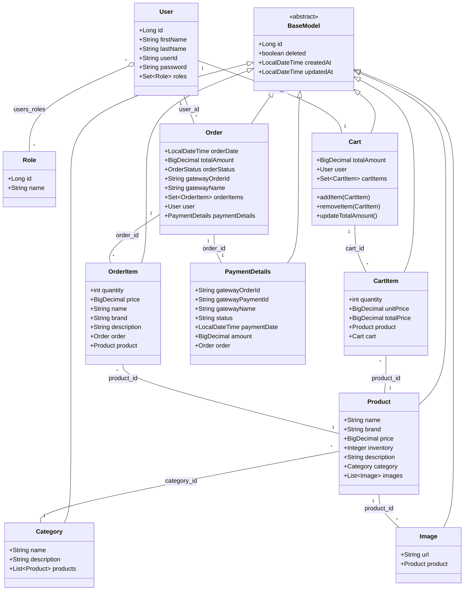

# DesiCart Class Diagram

This diagram represents the core entity relationships within the DesiCart project.

## Enums

### OrderStatus
- ORDER_PLACED
- ORDER_PENDING
- ORDER_CHECKED_OUT
- ORDER_EXPIRED
- ORDER_PAYMENT_INITIATED
- ORDER_PAID
- ORDER_PAYMENT_FAILED
- ORDER_PAYMENT_CANCELLED
- ORDER_SHIPPED
- ORDER_DELIVERED

### PaymentStatus
- SUCCESS
- FAILURE
- INITIATED
- CREATED
