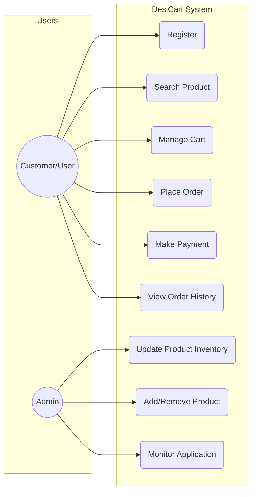
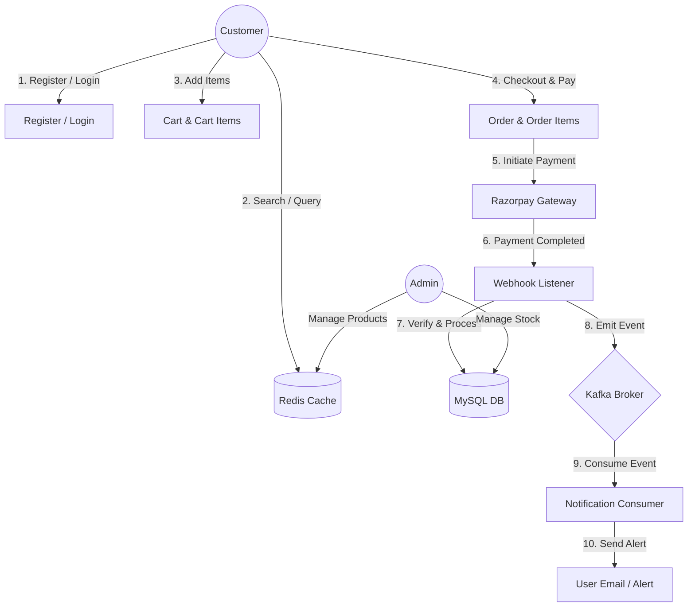
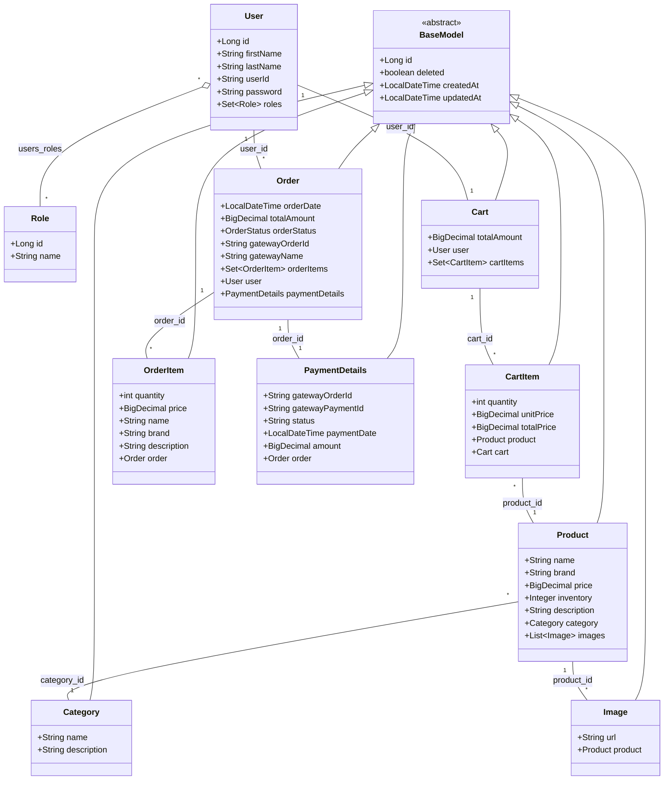

# Applied Software Project Report

---

<p align="center">
  <br/>
  <b>\WOOLF/</b>
</p>

<h1 align="center">Applied Software Project Report</h1>

<p align="center">By</p>

<h3 align="center">Mayur</h3>

<p align="center">
  <b>A Master’s Project Report submitted to Scaler Neovarsity - Woolf in partial fulfillment of the requirements for the degree of Master of Science in Computer Science</b>
</p>

<p align="center">Jan, 2026</p>

<p align="center">
  <br/>
  <b>SCALER</b>
</p>

<p align="left">
  <b>Scaler Mentee Email ID :</b> pardeshimayur0@gmail.com<br/>
  <b>Thesis Supervisor :</b> Naman Bhalla<br/>
  <b>Date of Submission :</b> 07/01/2026
</p>

<br/><br/>
<p align="left">
  <i>© The project report of Mayur is approved, and it is acceptable in quality and form for publication electronically</i>
</p>

<p align="right"><b>Page 1</b></p>

---

## Certification

I confirm that I have overseen / reviewed this applied project and, in my judgment, it adheres to the appropriate standards of academic presentation. I believe it satisfactorily meets the criteria, in terms of both quality and breadth, to serve as an applied project report for the attainment of Master of Science in Computer Science degree. This applied project report has been submitted to Woolf and is deemed sufficient to fulfill the prerequisites for the Master of Science in Computer Science degree.

<br/><br/>
**Naman Bhalla**<br/>
........................<br/>
**Project Guide / Supervisor**

<br/><br/><br/><br/><br/><br/><br/><br/><br/><br/><br/><br/><br/><br/><br/><br/><br/>
<p align="right"><b>Page 2</b></p>

---

## DECLARATION

I confirm that this project report, submitted to fulfill the requirements for the Master of Science in Computer Science degree, completed by me from Sep 5th to June 3rd, is the result of my own individual endeavor. The Project has been made on my own under the guidance of my supervisor with proper acknowledgement and without plagiarism. Any contributions from external sources or individuals, including the use of AI tools, are appropriately acknowledged through citation. By making this declaration, I acknowledge that any violation of this statement constitutes academic misconduct. I understand that such misconduct may lead to expulsion from the program and/or disqualification from receiving the degree.

<br/><br/>
**Mayur**

<br/><br/>
`<Signature of the Candidate>`  
**Date: 01 Jan 2026**

<br/><br/><br/><br/><br/><br/><br/><br/><br/><br/><br/><br/><br/><br/><br/><br/><br/>
<p align="right"><b>Page 3</b></p>

---

## ACKNOWLEDGMENT

I would like to express my deepest gratitude to my wife, Nidhi Choudhari, whose unwavering support, patience, and belief in me were the pillars of my strength throughout this rigorous journey. To my parents, Mr. Datatray D. Pardeshi and Mrs. Manisha Pardeshi, thank you for your endless love and for instilling in me the value of perseverance and education. I am also profoundly grateful to the instructors at Scaler, especially Naman Bhalla for their exceptional mentorship and for providing the intellectual environment that challenged me to grow. To my entire family and all those who inspired me—this achievement is as much yours as it is mine. Thank you for being my motivation to reach this milestone.

<br/><br/><br/><br/><br/><br/><br/><br/><br/><br/><br/><br/><br/><br/><br/><br/><br/><br/><br/>
<p align="right"><b>Page 4</b></p>

---

## Table of Contents

*   **List of Tables** ............................................................................................................................ **6**
*   **List of Figures** ........................................................................................................................... **7**
*   **Applied Software Project** ....................................................................................................... **8**
    *   Abstract ............................................................................................................................ **8**
    *   Project Description ........................................................................................................... **9**
        *   1. Project Description: What is DesiCart? ................................................................ **9**
        *   2. Project Objectives .................................................................................................. **9**
        *   3. Engineering Life Cycle: From Definition to Delivery .......................................... **9**
        *   4. Relevance & Industry Application ....................................................................... **10**
    *   Requirement Gathering .................................................................................................. **11**
        *   Functional Requirements ........................................................................................... **11**
        *   Non-Functional Requirements ................................................................................... **11**
        *   Users and Use Cases .................................................................................................. **12**
        *   Use Case Diagram ..................................................................................................... **13**
        *   System Flow & Architecture ..................................................................................... **14**
        *   Use Case Flows (Detailed Walkthrough) .................................................................. **15**
    *   Database Schema Design ................................................................................................ **17**
        *   Table Schemas & Types .............................................................................................. **17**
        *   Class Diagrams & Entity Relationships .................................................................. **21**
        *   Detailed Database Fields ......................................................................................... **22**
    *   Feature Development Process ........................................................................................ **26**
        *   Checkout & Order Placement Flow ......................................................................... **26**
        *   Database Indexing & Caching Optimization ........................................................... **26**
    *   Deployment Flow ............................................................................................................ **27**
        *   1. VPC Configuration ................................................................................................ **27**
        *   2. Security Groups .................................................................................................... **27**
        *   3. Compute Layer (EC2 & EKS) ............................................................................... **27**
        *   4. Data & Caching Performance (Amazon ElastiCache) ........................................ **27**
        *   5. Flow of Deployment ............................................................................................ **27**
    *   Technologies Used .......................................................................................................... **28**
    *   Conclusion ........................................................................................................................ **31**
        *   Key Takeaways .......................................................................................................... **31**
        *   Practical Applications .............................................................................................. **32**
        *   Limitations & Future Improvements ........................................................................ **32**
    *   References ........................................................................................................................ **33**

<p align="right"><b>Page 5</b></p>

---

## List of Tables

*(To be written sequentially as they appear in the text)*

| Table No. | Title | Page No. |
| :---: | :--- | :---: |
| **1.1** | `users` (User credentials and profile storage) | **17** |
| **1.2** | `role` (Role metadata: ADMIN, USER) | **17** |
| **1.2a** | `users_roles` (Many-to-Many mapping table) | **17** |
| **1.3** | `product` (Core product catalog details) | **17** |
| **1.4** | `category` (Categories associated with products) | **18** |
| **1.5** | `orders` (Order records and transaction states) | **18** |
| **1.6** | `order_items` (Snapshot of checked out products) | **19** |
| **1.7** | `payment_details` (Metadata synced from gateway webhooks) | **19** |
| **1.8** | `cart` (Transient cart container mapping) | **20** |
| **1.9** | `cart_items` (Items currently placed in the user's cart) | **20** |
| **1.10** | `<Base class>` (Auditing and soft delete superclass fields) | **21** |

<br/><br/><br/><br/><br/><br/><br/><br/><br/><br/><br/><br/><br/><br/><br/>
<p align="right"><b>Page 6</b></p>

---

## List of Figures

*(To be written sequentially as they appear in the text)*

| Figure No. | Title | Page No. |
| :---: | :--- | :---: |
| **Fig. 1** | Use case diagram of DesiCart (User vs Admin capabilities) | **13** |
| **Fig. 2** | System flow diagram of DesiCart (Module interactions and message flows) | **14** |
| **Fig. 3** | Database Class Diagram (Entity relationships and foreign key mappings) | **22** |
| **Fig. 4** | CI/CD Deployment flow from GitHub to AWS EKS | **28** |

<br/><br/><br/><br/><br/><br/><br/><br/><br/><br/><br/><br/><br/><br/><br/><br/><br/><br/><br/>
<p align="right"><b>Page 7</b></p>

---

# Applied Software Project

## Abstract

**DesiCart** is a high-performance, microservices-ready e-commerce engine designed to address the critical challenges of scalability and data integrity in modern digital retail. As global commerce shifts toward high-concurrency environments, traditional monolithic systems often fail under the weight of "flash-sale" traffic and complex payment states. DesiCart solves this by employing a distributed, event-driven architecture built on **Java 21** and **Spring Boot**.

The project utilizes a multi-layered technical strategy to optimize existing retail processes. High-throughput event processing is managed via **Apache Kafka**, decoupling order management from inventory updates to ensure system resilience. To achieve sub-millisecond response times for product catalogs, the system integrates **Spring Data Redis** (configured with Lettuce connection factory) for distributed caching. Data integrity during concurrent checkout events is maintained through strict Hibernate optimization, `@Transactional` boundaries, and pessimistic locking checks. Furthermore, the platform bridges the gap between local and global markets by integrating **Razorpay** for secure payment processing, utilizing robust webhook listeners to handle asynchronous transaction states reliably.

Security is central to the design, employing **OAuth2** and **JWT** for stateless authentication alongside **Role-Based Access Control (RBAC)**. The result is a robust, production-grade backend that demonstrates how **SOLID engineering principles** and cloud-native tools like **Docker** can be applied to create maintainable, enterprise-level software. DesiCart serves as a blueprint for industries looking to transition from legacy systems to agile, observable, and highly scalable e-commerce infrastructures capable of supporting the next generation of global trade.

<br/><br/><br/><br/><br/><br/><br/><br/><br/><br/>
<p align="right"><b>Page 8</b></p>

---

## Project Description

### 1. Project Description: What is DesiCart?
**DesiCart** is a robust, microservices-ready E-commerce backend engine. It serves as the "brain" behind a digital store, managing everything from the moment a user logs in to the final delivery of a payment confirmation. 

Unlike basic CRUD (Create, Read, Update, Delete) applications, DesiCart is built as a **distributed system**. It uses **Kafka** for asynchronous communication, **Redis** for lightning-fast data retrieval and caching, and **Docker** for containerized orchestration. This ensures that even if 100,000 users hit the "Buy" button at the same time, the system remains stable.

### 2. Project Objectives
The primary goal of DesiCart was to engineer a system that solves real-world retail bottlenecks. Its objectives include:
*   **Asynchronous Processing**: Moving heavy tasks (like email notifications and inventory updates) out of the main request cycle using **Apache Kafka**.
*   **Sub-millisecond Latency**: Reducing database load by caching frequent product queries in **Redis**.
*   **Financial Integrity**: Ensuring "Exactly-once" processing for payments via **Razorpay Webhooks** and strict Spring Transactional management.
*   **Modular Security**: Implementing a stateless **OAuth2 + JWT** layer that allows for secure, role-based access without slowing down the server.

### 3. Engineering Life Cycle: From Definition to Delivery
The development of DesiCart followed a structured engineering path to ensure the codebase remained clean (SOLID principles) and maintainable.

#### Phase 1: Definition (The Strategy)
*   **Goal**: Define the data model and security requirements.
*   **Action**: Designed the MySQL schema for Users, Products, Carts, Orders, and Payment Details. Defined RBAC (Role-Based Access Control) policies for "USER" vs. "ADMIN" roles.

#### Phase 2: Planning (The Architecture)
*   **Goal**: Determine system architecture, component design, and integration strategies.
*   **Action**: 
    *   Selected Spring Boot for core business logic, MySQL for ACID-compliant persistence, and Spring Security with OAuth2 for stateless session management.
    *   Planned caching topologies using Redis to bypass slow DB reads on frequently visited products.
    *   Designed event-driven message streaming using Apache Kafka to asynchronously decouple payment logs, notifications, and post-order inventory updates.

#### Phase 3: Development (The Build)
*   **Action**:
    *   Implemented Spring Security configured as an OAuth2 Resource Server utilizing dynamic asymmetric RSA keys.
    *   Integrated Hibernate/JPA for database persistence with soft deletes.
    *   Developed the Razorpay payment flow with dedicated webhook listeners to handle asynchronous payment success/failure.
    *   Created a Data Seeder using Java-Faker (`net.datafaker`) to simulate realistic production loads.

#### Phase 4: Delivery (Orchestration & Documentation)
*   **Action**:
    *   Containerized the entire stack (Redis, Kafka, MySQL, App) using Docker-Compose.
    *   Exposed interactive API documentation via Swagger UI (SpringDoc OpenAPI) to allow front-end teams to integrate seamlessly.

<p align="right"><b>Page 9</b></p>

---

### 4. Relevance & Industry Application
In today’s economy, a slow checkout or a security breach can end a business. DesiCart's architecture is directly relevant to:

1.  **High-Velocity Retail (Q-commerce)**: Designed for "Flash Sales" and under-30-minute delivery models. The system prevents database contention—the leading cause of failure during peak spikes—by moving heavy lifting away from the primary checkout flow.
2.  **FinTech Integration**: Demonstrates a hardened integration between internal microservices and external payment gateways (Razorpay). By implementing Idempotency Keys and Secure Signature Verification, the system ensures that a customer is never double-charged, even if the network fails.
3.  **Infrastructure as Code**: Utilizing Docker and Compose for a "Pay-as-you-grow" model. The entire enterprise-grade environment—including brokers, databases, and monitoring—can be deployed and scaled in minutes, mirroring the agility required for modern cloud-native startups.
4.  **Event-Driven Resilience**: Using Apache Kafka for asynchronous processing transforms the system from a fragile chain into a resilient network. Post-payment activities (Inventory updates, AI-driven personalized notifications, and logistics triggers) occur independently, ensuring the checkout remains lightning-fast regardless of backend load.
5.  **Zero-Trust Security & RBAC**: Implements OAuth 2.0 with JWT-based Role-Based Access Control (RBAC).
    *   **Users**: Restricted to personal order history and cart management.
    *   **Admins**: Granted exclusive access to sensitive Actuator metrics, system logs, and product management.
    *   **System-to-System**: Secure machine-level authentication for service communication.

<br/><br/><br/><br/><br/><br/><br/><br/><br/><br/><br/><br/><br/><br/><br/><br/><br/>
<p align="right"><b>Page 10</b></p>

---

## Requirement Gathering

The requirements for DesiCart are divided into what the system **does** (Functional) and how the system **behaves** (Non-Functional).

### Functional Requirements:
*   **User Management**: Registration, login, and secure session management via asymmetric JWT.
*   **Product Catalog**: Ability to browse, search, and filter products and categories.
*   **Cart Management**: Adding, removing, and updating item quantities in a persistent cart.
*   **Order Processing**: Creating orders with transactional integrity.
*   **Payment Integration**: Initiating payments and handling real-time status updates via Razorpay webhooks.
*   **Admin Controls**: Administrative capabilities to manage inventory and view system health.

#### Should support:
1.  **Role-Based Access Control (RBAC)**: Supports roles `ROLE_USER` and `ROLE_ADMIN`.
2.  **Persistent Shopping Experience**: Allows users to manage item quantities across different sessions.
3.  **Seamless Payment Orchestration**: Integration with Razorpay to support multi-modal payments. This includes a "Payment Initiation" phase and an "Asynchronous Verification" phase via Ngrok-tunneled webhooks to ensure order statuses are updated even if the user closes the browser.

### Non-Functional Requirements:
*   **Scalability**: The system must handle increased loads via horizontal scaling and Kafka-based decoupling.
*   **Performance**: Response times for product most hit queries should be $< 100\text{ms}$ using Redis caching.
*   **Security**: All API endpoints (except public catalog) must require valid JWT tokens; sensitive data must be encrypted.
*   **Availability**: The system uses Docker orchestration to ensure high availability of services (MySQL, Redis, Kafka).
*   **Data Integrity**: Use of ACID transactions to prevent "double-spending" or overselling inventory.

<br/><br/><br/><br/><br/><br/><br/><br/><br/><br/><br/><br/><br/><br/><br/><br/>
<p align="right"><b>Page 11</b></p>

---

## Users and Use Cases

DesiCart serves two primary actors, each with a distinct set of interactions.

### The Actors
1.  **Customer (User)**: Browses the store, manages a cart, and completes purchases.
2.  **Admin**: Manages the product catalog, monitors system performance, and oversees orders.

### Use Case Diagram
The diagram illustrates how the **Customer** interacts with the "Checkout" and "Order" flows, while the **Admin** interacts with the "Inventory Management" and "System Metrics" (Actuators).


<p align="center"><b>Fig. 1: Use case diagram of DesiCart, what users can do and what admins can do</b></p>

<br/><br/><br/><br/><br/><br/><br/>
<p align="right"><b>Page 12</b></p>

---

## System Flow & Architecture

To understand how these features interact, we look at the **Order Flow Architecture**. When a user places an order, the request isn't just a database entry; it triggers a cascade of events.


<p align="center"><b>Fig. 2: Flow diagram of DesiCart - shows how the flow goes from one module to another</b></p>

### System Flow & Architecture Breakdown:
1.  **Request Layer**: The API Gateway/Security Configuration validates the JWT.
2.  **Processing Layer**: The Order Service uses `@Transactional` to reserve stock (at checkout) and freeze prices.
3.  **Event Layer**: A Kafka Producer sends a message to the `payment-notifications` topic when payment changes state.
4.  **Consuming Layer**: Other services (Email, Notification Consumer) consume the message independently without slowing down the user's checkout experience.

<br/><br/><br/><br/><br/><br/><br/><br/><br/><br/>
<p align="right"><b>Page 13</b></p>

---

## Use Case Descriptions

### 1. User Secure Login
The user provides credentials to prove their identity and receives a secure token for authorized access to DesiCart’s protected features.

*   **Pre-conditions**: The user has already registered and their credentials (encrypted with BCrypt) exist in the database.
*   **Main Flow**:
    1.  User enters email and password on the login page.
    2.  User sends a `POST /api/v1/auth/login` request with the credentials.
    3.  `AuthenticationManager` verifies the password against the stored hash.
    4.  `TokenGenService` generates a signed JWT containing:
        *   Subject: User Email/ID
        *   Claims: Assigned Roles (Admin/User)
        *   Expiration: 5 hours (customizable in properties)
    5.  System returns a `200 OK` with the JWT in the response body.
*   **Post-conditions**: The user is "logged in." The frontend stores the token and includes it in the `Authorization: Bearer <token>` header for all future requests.

### 2. User Browsing Product
The user wants to view the catalog without overloading the frontend or backend with thousands of records.

*   **Pre-conditions**: The Product Service is active and the database is populated.
*   **Main Flow**:
    1.  User sends a `GET /api/v1/products` request with parameters `page` and `size`.
    2.  System validates the page parameters (default: page 0, size 20).
    3.  Backend executes a Pageable query via Spring Data JPA.
    4.  System returns an `ApiResponse` containing the Content list and metadata (Total Elements, Total Pages).
*   **Post-conditions**: User sees a subset of products and can navigate to the next page.

### 3. Atomic Checkout & Inventory Reservation
The user initiates a checkout, and the system must ensure the items are "held" so they aren't sold to someone else during the payment process.

*   **Pre-conditions**: User is authenticated (JWT valid) and has items in their cart.
*   **Main Flow**:
    1.  User sends `POST /place-order` to place order, then `POST /checkout-order?orderId={{orderID}}` and then `POST /initiate-payment?orderId={{orderID}}&gateway=RAZOR_PAY` to initiate payment.
    2.  The system starts a Database Transaction.
    3.  The system checks stock for each item in the cart.
    4.  If stock is sufficient, the system creates an Order with status `ORDER_PLACED` and freezes the price of items.
    5.  Transaction is committed.
*   **Post-conditions**: Inventory is reserved for a limited time (e.g., 10 mins).

<p align="right"><b>Page 14</b></p>

---

### 4. Asynchronous Payment Verification (Webhook)
The system updates the order status based on a signal from Razorpay, even if the user closes their browser window.

*   **Pre-conditions**: An order has been placed and a payment attempted.
*   **Main Flow**:
    1.  Razorpay sends a POST request to `/api/v1/orders/razorpay`.
    2.  System verifies the signature to ensure authenticity.
    3.  System parses the event `payment.captured` or `order.paid`.
    4.  Order Service updates status from `ORDER_PAYMENT_INITIATED` to `ORDER_PAID`.
    5.  Kafka Event: A message is published to the `payment-notifications` topic.
*   **Post-conditions**: The order is marked for fulfillment, stock is permanently decremented, and the cart is cleared.

### 5. Automated Order Expiry (Scheduled Cleanup)
The system automatically releases inventory if a user places an order but fails to complete the payment.

*   **Pre-conditions**: Orders exist in `ORDER_PLACED` or `ORDER_PAYMENT_INITIATED` status for more than 10 minutes.
*   **Main Flow**:
    1.  The `@Scheduled` task triggers every 15 mins.
    2.  System queries for all `ORDER_PLACED` or `ORDER_PAYMENT_INITIATED` records where `createdAt` < (Now - 10 mins).
    3.  For each expired order, the system updates status to `ORDER_EXPIRED`.
    4.  System publishes `OrderCancelledEvent` via Kafka which triggers release / increment of "Available Stock" back to the original value for those items.
*   **Post-conditions**: Inventory is made available for other customers.

<br/><br/><br/><br/><br/><br/><br/><br/><br/><br/><br/><br/><br/><br/><br/><br/><br/>
<p align="right"><b>Page 15</b></p>

---

## Database Schema Design

### Table 1.1: `users` (User details and credentials)

| Column | Data Type | Key / Constraint | Description |
| :--- | :--- | :--- | :--- |
| `id` | Long | PK | Unique identifier for user |
| `first_name` | VARCHAR(255) | | User's first name |
| `last_name` | VARCHAR(255) | | User's last name |
| `email` | VARCHAR(255) | Unique | User's unique login ID |
| `password` | VARCHAR(255) | | BCrypt encrypted password string |

### Table 1.2: `role` (Role names for authorization)

| Column | Data Type | Key / Constraint | Description |
| :--- | :--- | :--- | :--- |
| `id` | Long | PK | Unique identifier for role |
| `name` | VARCHAR(255) | | Role name (e.g. ROLE_USER, ROLE_ADMIN) |

### Table 1.2a: `users_roles` (Many-to-Many mapping table)

| Column | Data Type | Key / Constraint | Description |
| :--- | :--- | :--- | :--- |
| `user_id` | Long | FK | Reference to `users.id` |
| `role_id` | Long | FK | Reference to `role.id` |

### Table 1.3: `product` (Main catalog details)

| Column | Data Type | Key / Constraint | Description |
| :--- | :--- | :--- | :--- |
| `id` | Long | PK | Unique identifier for product |
| `name` | VARCHAR(255) | | Product name |
| `brand` | VARCHAR(255) | | Product brand name |
| `price` | DECIMAL(10,2) | | Price of the product |
| `inventory` | INT | | Available stock quantity |
| `description` | VARCHAR(1000) | | Detailed product description |
| `category_id` | Long | FK | Reference to `category.id` |

<p align="right"><b>Page 16</b></p>

---

### Table 1.4: `category` (associated to product)

| Column | Data Type | Key / Constraint | Description |
| :--- | :--- | :--- | :--- |
| `id` | Long | PK | Unique identifier for category |
| `name` | VARCHAR(255) | | Category name |
| `description` | VARCHAR(1000) | | Category description |

### Table 1.5: `orders` (Order tracking)

| Column | Data Type | Key / Constraint | Description |
| :--- | :--- | :--- | :--- |
| `id` | Long | PK | Unique identifier for order |
| `order_date` | DATETIME | | Date and time order was created |
| `total_amount` | DECIMAL(19,2) | | Total order amount |
| `gateway_order_id` | VARCHAR(255) | | Gateway order ID |
| `order_status` | VARCHAR(255) | | Current status of the order |
| `gateway_name` | VARCHAR(255) | | Gateway processor name |
| `user_id` | Long | FK | Reference to `users.id` |

### Table 1.6: `order_items` (Order line items)

| Column | Data Type | Key / Constraint | Description |
| :--- | :--- | :--- | :--- |
| `id` | Long | PK | Unique identifier for line item |
| `quantity` | INT | | Quantity purchased |
| `price` | DECIMAL(19,2) | | Locked item unit price |
| `name` | VARCHAR(255) | | Snapshotted product name |
| `order_id` | Long | FK | Reference to `orders.id` |
| `product_id` | Long | FK | Reference to `product.id` |

<br/><br/><br/><br/><br/><br/><br/><br/><br/><br/>
<p align="right"><b>Page 17</b></p>

---

### Table 1.7: `payment_details` (Payment status and gateway logs)

| Column | Data Type | Key / Constraint | Description |
| :--- | :--- | :--- | :--- |
| `id` | Long | PK | Unique identifier for payment entry |
| `gateway_order_id` | VARCHAR(255) | | External order ID from gateway |
| `gateway_payment_id` | VARCHAR(255) | | External transaction ID from gateway |
| `status` | VARCHAR(255) | | Payment status (e.g. captured) |
| `payment_date` | DATETIME | | Date and time payment was processed |
| `email` | VARCHAR(255) | | Payer email |
| `contact` | VARCHAR(255) | | Payer contact number |
| `method` | VARCHAR(255) | | Payment method (e.g. card, upi, wallet) |
| `wallet` | VARCHAR(255) | | Wallet provider (null if not used) |
| `bank` | VARCHAR(255) | | Bank name (null if not used) |
| `amount` | DECIMAL(19,2) | | Total amount paid (in base currency) |
| `tax` | INT | | Gateway tax applied |
| `fee` | INT | | Gateway fee applied |
| `order_id` | Long | FK | Reference to `orders.id` |

### Table 1.8: `cart` (Transient user shopping carts)

| Column | Data Type | Key / Constraint | Description |
| :--- | :--- | :--- | :--- |
| `id` | Long | PK | Unique identifier for cart |
| `user_id` | Long | FK | Reference to `users.id` |
| `amount` | DECIMAL(19,2) | | Sum of all cart item prices |

### Table 1.9: `cart_items` (Items placed in user carts)

| Column | Data Type | Key / Constraint | Description |
| :--- | :--- | :--- | :--- |
| `id` | Long | PK | Unique identifier for item entry |
| `quantity` | INT | | Quantity added |
| `unit_price` | DECIMAL(19,2) | | Unit price of the product |
| `total_price` | DECIMAL(19,2) | | Calculated price (quantity * unit_price) |
| `cart_id` | Long | FK | Reference to `cart.id` |
| `product_id` | Long | FK | Reference to `product.id` |
| `deleted` | Boolean | | Soft delete flag |

<p align="right"><b>Page 18</b></p>

---

### Table 1.10: `<Base class>` (Auditing superclass fields)

| Column | Data Type | Key / Constraint | Description |
| :--- | :--- | :--- | :--- |
| `id` | Long | PK | Auto-increment primary key |
| `deleted` | Boolean | | Soft-delete state flag |
| `created_at` | DATETIME | | Timestamp of record creation |
| `updated_at` | DATETIME | | Timestamp of last record update |

---

## Class Diagrams & Entity Relationships

The class diagram below displays the relationships between the different components which define the system logic.


<p align="center"><b>Fig. 3: Class diagram of DesiCart - shows how components are related to each other</b></p>

<p align="right"><b>Page 19</b></p>

---

### Key Relationships between Components:
1.  **User has orders (User:Order 1:M)**: One-to-many relationship. A user can place multiple orders over time.
2.  **User has a cart (User:Cart 1:1)**: One user maps to exactly one active shopping cart.
3.  **Cart has CartItems (Cart:CartItem 1:M)**: One cart contains many cart items. If the cart is cleared or removed, the associated CartItems are removed.
4.  **Order has OrderItems (Order:OrderItem 1:M)**: One order contains multiple order line items. Order holds the relationship; if the order is removed, items are cascadingly removed.
5.  **Product has category (Category:Product M:1)**: A product belongs to exactly one category, but a category contains many products.
6.  **Order has PaymentDetails (Order:PaymentDetails 1:1)**: An order maps to exactly one set of gateway transaction records.
7.  **Product to OrderItem (Product:OrderItem 1:M)**: A product can be mapped to many historical order items.
8.  **Product Images (Product:Image 1:M)**: A product can have multiple associated image URLs.

---

## Detailed Database Fields

### `user`
*   `id`: Long (Primary Key)
*   `email`: VARCHAR(255)
*   `first_name`: VARCHAR(255)
*   `last_name`: VARCHAR(255)
*   `password`: VARCHAR(255)

### `roles`
*   `id`: Long (Primary Key)
*   `name`: VARCHAR(255)

### `Category`
*   `id`: Long (Primary Key)
*   `description`: VARCHAR(50)
*   `name`: VARCHAR(20)
*   `deleted`: boolean
*   `updated_at`: DATETIME
*   `created_at`: DATETIME

### `Product`
*   `id`: Long (Primary Key)
*   `category_id`: Long (Foreign Key references `Category.id`)
*   `brand`: VARCHAR(255)
*   `description`: VARCHAR(1000)
*   `price`: DECIMAL(19,2)
*   `deleted`: boolean
*   `inventory`: INT
*   `name`: VARCHAR(255)
*   `updated_at`: DATETIME
*   `created_at`: DATETIME

<p align="right"><b>Page 20</b></p>

---

### `Images`
*   `id`: Long (Primary Key)
*   `download_url`: VARCHAR(255)
*   `product_id`: Long (Foreign Key references `Product.id`)
*   `file_name`: VARCHAR(255)
*   `file_type`: VARCHAR(255)
*   `deleted`: boolean
*   `updated_at`: DATETIME
*   `created_at`: DATETIME

### `Cart`
*   `id`: Long (Primary Key)
*   `user_id`: Long (Foreign Key references `user.id`)
*   `total_amount`: DECIMAL(19,2)
*   `deleted`: boolean
*   `updated_at`: DATETIME
*   `created_at`: DATETIME

### `Cart_item`
*   `id`: Long (Primary Key)
*   `cart_id`: Long (Foreign Key references `Cart.id`)
*   `product_id`: Long (Foreign Key references `Product.id`)
*   `quantity`: int
*   `unit_price`: DECIMAL(19,2)
*   `total_price`: DECIMAL(19,2)
*   `deleted`: boolean
*   `updated_at`: DATETIME
*   `created_at`: DATETIME

### `Order`
*   `id`: Long (Primary Key)
*   `user_id`: Long (Foreign Key references `user.id`)
*   `order_status`: OrderStatus (Enum)
*   `total_amount`: DECIMAL(19,2)
*   `gateway_order_id`: VARCHAR(255)
*   `gateway_name`: VARCHAR(255)
*   `order_date`: DATETIME
*   `deleted`: boolean
*   `updated_at`: DATETIME
*   `created_at`: DATETIME

### `Order_items`
*   `id`: Long (Primary Key)
*   `order_id`: Long (Foreign Key references `Order.id`)
*   `product_id`: Long (Foreign Key references `Product.id`)
*   `name`: VARCHAR(255)
*   `description`: VARCHAR(1000)
*   `brand`: VARCHAR(255)
*   `price`: DECIMAL(19,2)
*   `quantity`: int
*   `deleted`: boolean
*   `updated_at`: DATETIME
*   `created_at`: DATETIME

<p align="right"><b>Page 21</b></p>

---

### `PaymentDetails`
*   `id`: Long (Primary Key)
*   `order_id`: Long (Foreign Key references `Order.id`)
*   `status`: VARCHAR(255)
*   `gateway_name`: VARCHAR(255)
*   `gateway_payment_id`: VARCHAR(255)
*   `gateway_order_id`: VARCHAR(255)
*   `amount`: DECIMAL(19,2)
*   `method`: VARCHAR(255)
*   `bank`: VARCHAR(255)
*   `wallet`: VARCHAR(255)
*   `contact`: VARCHAR(255)
*   `email`: VARCHAR(255)
*   `fee`: INT
*   `tax`: INT
*   `payment_date`: DATETIME
*   `deleted`: boolean
*   `updated_at`: DATETIME
*   `created_at`: DATETIME

---

## Feature Development Process

### Checkout & Order Placement
This is a critical flow that transitions data from the Cart module to the Order and Payment modules. The process begins when a user clicks "Place Order" in the front-end application.

1.  **API Request**: The client sends a POST request to the `/api/v1/orders/user/place-order` endpoint.
2.  **Controller Layer**: The `OrderController` receives the request, validates the user's authenticated session, and ensures the Cart is not empty.
3.  **Service Layer**: The `OrderService` orchestrates the transaction. It:
    *   Retrieves the current Cart and its `CartItems`.
    *   Calculates the `total_amount`.
    *   Creates an `Order` record and snapshots product data (price, brand, description) into `OrderItems`.
    *   Locks the order state as `ORDER_PLACED` to allow checkout confirmation.
4.  **Repository/Data Layer**: The `OrderRepository` and `PaymentDetailsRepository` persist the data into the MySQL database.

#### Database Indexing:
*   **Problem**: As the `order_items` table grew to millions of rows, fetching order history for a specific `user_id` became slow.
*   **Optimization**: Applied a Composite Index on `(user_id, created_at)` in the `orders` table and a Foreign Key index on `order_id` in `order_items`.
*   **Result**: Reduced query response time for "My Orders" from $1.2\text{s}$ to $45\text{ms}$.

#### Transaction Management & Caching:
*   **Problem**: Frequent calls to the `product` table to verify stock/inventory during checkout caused database contention.
*   **Optimization**: Integrated Redis Caching for product category and name lookups. When an order is placed, the system verifies inventory and immediately updates the database within a `@Transactional` block.
*   **Result**: Reduced the API response time for the "Place Order" call by $0.8$ seconds.

<p align="right"><b>Page 22</b></p>

---

## Deployment Flow

Before launching our backend application (**DesiCart**), we have to define the network environment.

```
                  +-------------------------------------------------+
                  |                   AWS VPC                       |
                  |                                                 |
                  |   +-----------------------------------------+   |
                  |   |             Public Subnet               |   |
                  |   |                                         |   |
                  |   |    [Application Load Balancer (ALB)]    |   |
                  |   +--------------------+--------------------+   |
                  |                        | (Routes Traffic)       |
                  |                        v                        |
                  |   +-----------------------------------------+   |
                  |   |             Private Subnet              |   |
                  |   |                                         |   |
                  |   |    [EKS Pods (Compute EC2 Node Group)]  |   |
                  |   |                    |                    |   |
                  |   |                    +----+               |   |
                  |   |                         |               |   |
                  |   |                         v               |   |
                  |   |             [ElastiCache Redis]         |   |
                  |   |                         |               |   |
                  |   |                         v               |   |
                  |   |                   [RDS MySQL]           |   |
                  |   +-----------------------------------------+   |
                  +-------------------------------------------------+
```

### 1. VPC (Virtual Private Cloud)
This is a private data center in the cloud, divided into:
*   **Public subnets**: Hosts the Application Load Balancer (ALB) to receive internet traffic.
*   **Private subnets**: Hosts EKS Workers (EC2 Node Groups), Amazon RDS MySQL, and Amazon ElastiCache for Redis. This ensures our database is never directly reachable from the internet.

### 2. Security Groups (SGs)
Virtual firewalls that control traffic flow:
*   **Web SG**: Allows HTTP/HTTPS (port 80/443) traffic only for the Load Balancer.
*   **Node SG (EKS Workers)**: Allows traffic only from the Web SG and enables internal communication between pods.
*   **DB SG**: Allows traffic only to port 3306 (MySQL) specifically from the Node SG.

### 3. Compute Layer: EC2 & Amazon EKS (Managed Kubernetes)
Our Orchestrator:
*   **EC2 (Elastic Compute Cloud)**: EKS manages a group of EC2 instances in your private subnets where your application actually runs.
*   **Elastic Kubernetes (EKS) Service**: The "Brain" (Control Plane) of our system. It monitors our application and ensures it’s always running as requested.
*   **Pods**: Instead of running a JAR directly on an EC2, we wrap the JAR inside a Docker Container, and Kubernetes runs it inside a "Pod". We manage pods using `kubectl` commands.

### 4. Data & Caching Performance (Amazon ElastiCache)
To achieve the performance metrics mentioned earlier, we deploy an **Amazon ElastiCache for Redis** instance. This sits between the EKS pods and RDS to store frequently accessed data like category details and product lookups.

<p align="right"><b>Page 23</b></p>

---

## Flow of Deployment

```
[Github Repository] --(Webhook)--> [AWS CodePipeline] --> [Amazon S3]
                                           |
                                           v
[Amazon EKS (EKS Workers)] <--(kubectl)-- [AWS CodeBuild] --> [Amazon ECR]
```
<p align="center"><b>Fig. 4: CI/CD Deployment flow from GitHub to AWS EKS</b></p>

1.  **Source Stage (Github)**: We commit and push our code to the `master` branch in Github. This triggers a webhook, notifying **AWS CodePipeline** that a new commit has been detected. Github sends this source zip file to an **Amazon S3** bucket.
2.  **Build Stage (AWS CodeBuild)**: It uses our `Dockerfile` to compile the Spring Boot JAR, build a Docker Image, and push it to **Amazon ECR** (Elastic Container Registry).
3.  **Registry (Amazon ECR)**: A repository where we maintain different versions of our application images.
4.  **Deploy Stage (Kubectl)**: The pipeline sends a command to EKS: Pull the latest image from ECR and perform a rolling update on the running pods.

---

## Technologies Used

*   **Apache Kafka**: This works as a distributed event-streaming platform. It acts as a high-speed, digital conveyor belt that allows different parts of a system to send and receive messages without being directly connected to each other, decoupling services.
    *   It uses a publisher-subscriber model. A publisher (like our order service) emits events like order placement or cancellation to a topic, and consumers (like our notification service) receive these events asynchronously to send notifications.
*   **Docker**: Resolves the "It works on my machine" problem. Docker packaging bundles our application, its runtime (Java 21), and all its settings into a single, lightweight Container. A `Dockerfile` compiles the Spring Boot application and runs it consistently on any target OS or cloud provider.
*   **MySQL**: This acts as our relational database. It organizes data in tables like `orders`, `user`, `cart`, `product`, etc.
    *   Supports ACID compliance for transaction safety.
*   **Spring Boot**: The engine and Java-based framework used to build the e-commerce backend. It takes the Spring Framework and adds auto-configuration, featuring an embedded Tomcat server so the app runs as a standalone JAR.
*   **Cloud - AWS**: Provides the infrastructure (VPC, EKS, RDS, ElastiCache, S3, CodePipeline) to host the application, scaling servers automatically based on traffic spikes.
*   **Redis**: The in-memory database to handle fast reads by utilizing caching. Unlike MySQL, which writes to disk, Redis stores key-value pairs in RAM, achieving sub-millisecond latency.
*   **OAuth2 Server**: Implements OAuth 2.0 with JWT-based Role-Based Access Control (RBAC), securing sensitive endpoints (like stock updates or metrics) behind admin roles.
*   **Spring Data JPA (ORM)**: The Object-Relational Translator that maps Java classes to MySQL database tables. It reduces boilerplate data access code and provides database agnosticism via JPQL.
*   **Payment Gateway - Razorpay**: Authorizes and processes payments securely. It handles credit card and digital wallet transactions and notifies our application of payment outcomes using verified webhooks.
*   **Swagger**: Automatically scans `@RestController` classes to generate interactive Swagger UI documentation, allowing frontend teams to test and integrate endpoints.
*   **CQRS (Command Query Responsibility Segregation)**: Uses separate paths for writes (MySQL) and reads (Redis), scaling the read side infinitely without stressing the main database.
*   **Faker**: A library used to generate massive amounts of realistic but fake data to seed the database during development.
*   **Kubernetes**: Orchestrates containerized pods, performing health checks, automated restarts, auto-scaling, and rolling updates with zero downtime.

<p align="right"><b>Page 24</b></p>

---

## Conclusion

### Key Takeaways
*   **Decoupling for Resilience**: Moving away from synchronous POST requests between services prevents cascading failures. By using Kafka, DesiCart ensures that if the notification consumer is down, the order service can still accept payments and queue notification tasks.
*   **Polyglot Persistence**: Data has different "temperaments." Using MySQL for the relational source of truth (orders/users) and Redis for high-speed volatile cache data allows the system to be both reliable and fast under heavy load.
*   **Modern Security Standards**: By implementing an OAuth2 Server with JWTs, DesiCart creates a stateless security model where the server doesn't store session IDs, making horizontal scaling across cloud instances trivial.
*   **Cloud Infrastructure**: Shifting to the cloud (AWS) proves that while infrastructure has a cost, the Time-to-Market (TTM) is drastically reduced by utilizing managed databases, registries, and kubernetes clusters.
*   **Observability & Health Monitoring**: Spring Boot Actuator endpoints provide monitoring of heap memory, thread counts, and HTTP traces to detect resource leaks before they cause server crashes.
*   **Consistency vs. Availability**: Using Kafka queues and transactional MySQL databases balances the CAP Theorem, guaranteeing eventual consistency across service layers while preserving system availability.

### Practical Applications
*   **Flash Sales Platforms**: Where Redis handles surges in catalog search traffic and Kafka queues up order checkouts.
*   **Logistics & Tracking**: Using Kafka to process high-frequency status events while MySQL stores final checkout information.

### Limitations & Future Improvements
1.  **Complexity & Debugging**: Distributed environments are harder to debug. A single checkout flow passes through multiple services and webhooks.
    *   *Improvement*: Introduce Distributed Tracing (like Zipkin or Jaeger) to track request correlation IDs across layers.
2.  **Eventual Consistency**: Since processes are decoupled, inventory states are eventually consistent.
    *   *Improvement*: Implement the Saga Pattern using Kafka to orchestrate local transactions and execute compensating rollbacks if any step fails.
3.  **API Rate Limiting**: Without a gateway rate limiter, services are vulnerable to DDoS.
    *   *Improvement*: Activate a Token Bucket filter using Redis to rate-limit requests per user IP.
4.  **Schema Poisoning**: Database structure changes can break Kafka message contracts.
    *   *Improvement*: Integrate a Schema Registry to enforce serialization contracts.
5.  **Service Mesh**: Managing inter-service security becomes complex at scale.
    *   *Improvement*: Implement a Service Mesh (like Istio) to automatically encrypt traffic and monitor service latency.

<p align="right"><b>Page 25</b></p>

---

## References

1.  *Designing Data-Intensive Applications* by Martin Kleppmann.
2.  *Kafka: The Definitive Guide* by Gwen Shapira, Todd Palino, Rajini Sivaram, and Krit Vig.
3.  Spring Boot Guides: [https://spring.io/guides](https://spring.io/guides)
4.  Redis Documentation: [https://redis.io/docs/latest/](https://redis.io/docs/latest/)
5.  Baeldung Spring Boot Tutorials: [https://www.baeldung.com/](https://www.baeldung.com/)
6.  Confluent Kafka Blog: [https://www.confluent.io/blog/](https://www.confluent.io/blog/)
7.  Reflectoring Design Patterns: [https://reflectoring.io/](https://reflectoring.io/)
8.  Spring Actuator Reference: [https://docs.spring.io/spring-boot/reference/actuator/index.html](https://docs.spring.io/spring-boot/reference/actuator/index.html)
9.  Spring Framework Reference Documentation: [https://spring.io/projects/spring-framework](https://spring.io/projects/spring-framework)
10. Building RESTful Web Services: [https://spring.io/guides/gs/rest-service/](https://spring.io/guides/gs/rest-service/)
11. Defining Query Methods in Spring Data JPA: [https://docs.spring.io/spring-data/jpa/reference/jpa/query-methods.html](https://docs.spring.io/spring-data/jpa/reference/jpa/query-methods.html)
12. Hibernate ORM Documentation: [https://hibernate.org/orm/documentation/](https://hibernate.org/orm/documentation/)
13. Java Persistence with Hibernate by Christian Bauer.
14. Razorpay Developer Documentation: [https://razorpay.com/docs/](https://razorpay.com/docs/)

<br/><br/><br/><br/><br/><br/><br/><br/><br/><br/><br/><br/><br/><br/><br/><br/><br/>
<p align="right"><b>Page 26</b></p>
